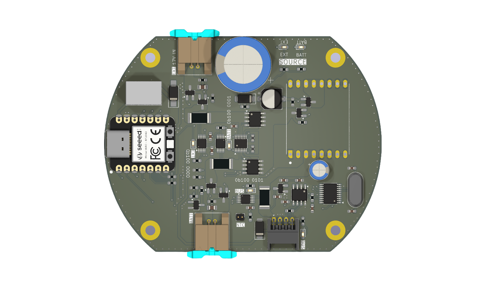
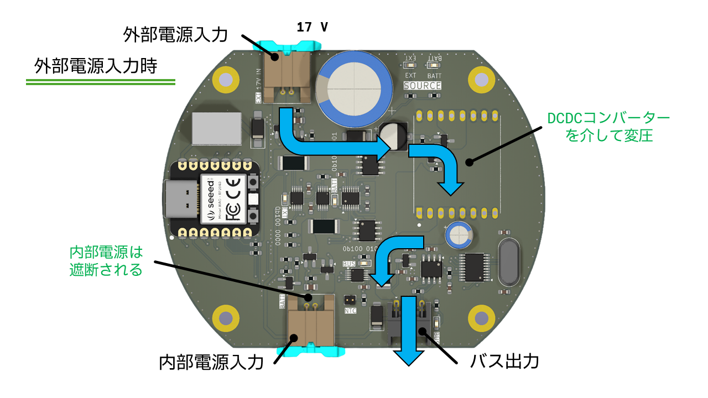
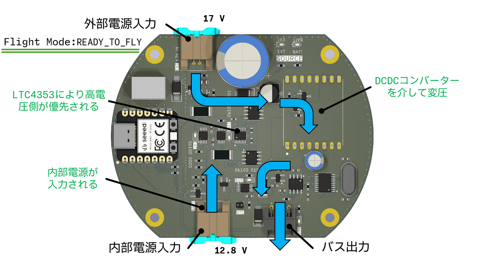
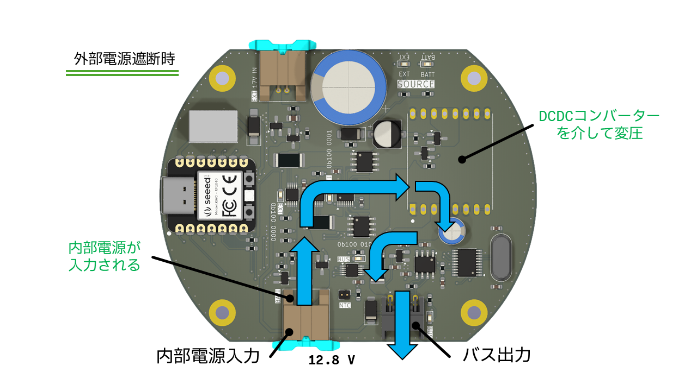

# Power Module (すばる1.3)

## 概要
ロケットの外部電源と内部電源を自動切換え機能を搭載しつつ，最大負荷5Aに対応した電源管理モジュールです．

## 主な構成部品
- **MCU**: `Seeed XIAO RP2040`
  - パワーモジュールを制御するマイコンです．
  - 実装されたフルカラーLEDを用いて内部電源の残量を表示可能
- **電流・電圧・電力モニター**: [`INA228`](https://www.digikey.jp/ja/products/detail/texas-instruments/INA228AIDGSR/13691042)
  - Adafruit社のモジュールを参考にし回路を構成
  - A0とA1ピンを用いてI2Cアドレスを変更可能な点が魅力的
- **電源制御IC**: [`LTC4353`](https://www.digikey.jp/ja/products/detail/analog-devices-inc/LTC4353IMS-PBF/3305800)
  - 2つの外付けMOSFETを制御し理想ダイオードOR回路を実装
  - MOSFETの選定には[`Si26DY`](https://www.digikey.jp/ja/products/detail/vishay-siliconix/SI4126DY-T1-GE3/1978841)がおすすめ（データシートの構成を参考）
- **DCDCコンバーター**: [`LTC3119`](https://strawberry-linux.com/catalog/items?code=13119)
  - 昇圧＋降圧に対応かつ最大負荷5A，さらに耐圧18Vと高スペックなICとなっている．
  - しかし，少し高価なICとなっている．
  - 代替品として，[SC8721](https://strawberry-linux.com/catalog/items?code=18721) という選択肢もあるが試すことができていないが1/4のコストは魅力的である．
- **ロードスイッチ**: [`AO3401AとAO3400A`]
  - Pch MOSFET の AO3401A をBack to back 接続し電流の逆流防止回路を構成
  - 秋月電子で販売終了したためピンコンパチか，代替品を探す必要有り

## 機能
### 電力モニター
3つの INA228 により，外部電源，内部電源，バス電源を監視することが可能となっている．
内部電源の監視はLiFePO4バッテリーの最小放電電圧を監視し，計測した電圧は内部電源遮断信号のトリガーとなっている．

### 電源切替
電源切替時の動作は電源をどのように接続したかとフライトモードの状態により変化する．
#### 外部電源入力時 
外部電源が入力されるとDCDCコンバーターを介して昇圧，もしくは降圧されバスへと出力される．
同時に，マイコンへ給電される．
この時，内部電源はロードスイッチのゲートが駆動しないため，遮断される．これにより，外部電源が接続されたとしてもバスを通じて各モジュールには電源投入されるが，内部電源は消費せずに運用することが可能となる．

詳しくは，回路を見ながらソースコードを参照すると理解しやすいはず．

#### FlightMode変化時
Flight Mode が変化し READY_TO_FLY になると，内部電源が入力される．しかし，LTC4353 は高い電圧を優先するため外部電源（17 V）が入力されている間は内部電源（公称 12.8 V）の消費を抑えてくれる．

#### 外部電源遮断＋FlightMode変化時
FlihtMode が READY_TO_FLY 時に外部電源が遮断されると内部電源へと自動的に切り替わりDCDCコンバーターを介してバスに出力される．
内部電源がバスに出力された後は内部電源が 11V に降下すると内部電源が MOSFET により遮断される．これにより，LiFePO4バッテリーの過放電を防ぐ．
この過放電を防ぐための最小電圧は負荷をすべて接続し，LiFePO4バッテリーの放電グラフを作成し決定した．理論上では最小放電電圧はバッテリー1つあたり 2V （合計 2V x 4つ = 8V）だが安全を考慮し 11V に設定した．この値はプログラムで自由に調整可能となっている．

