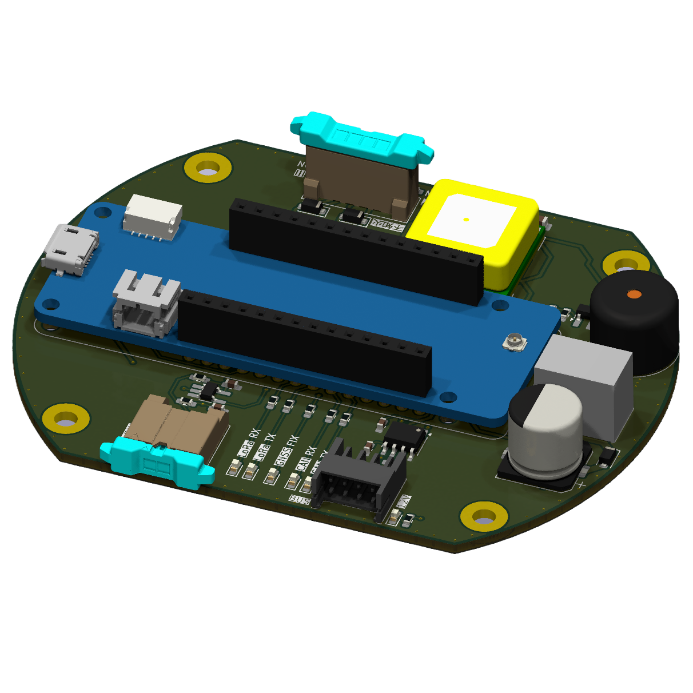
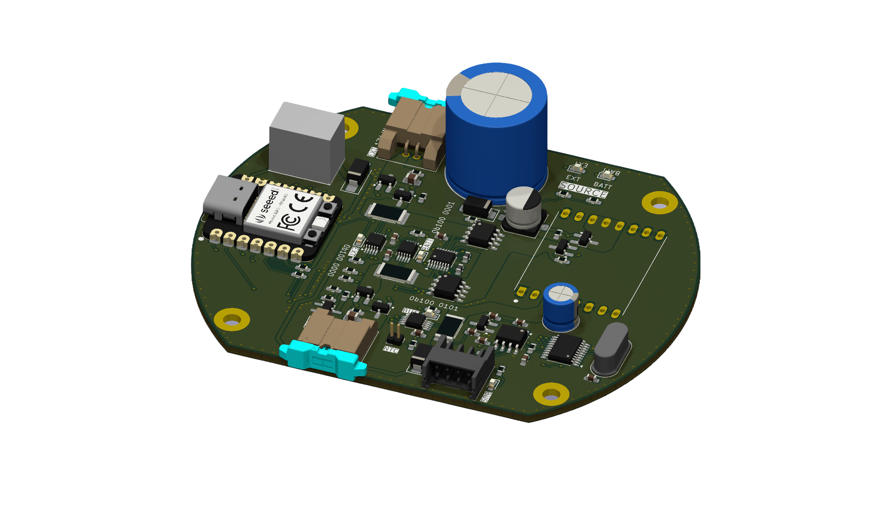
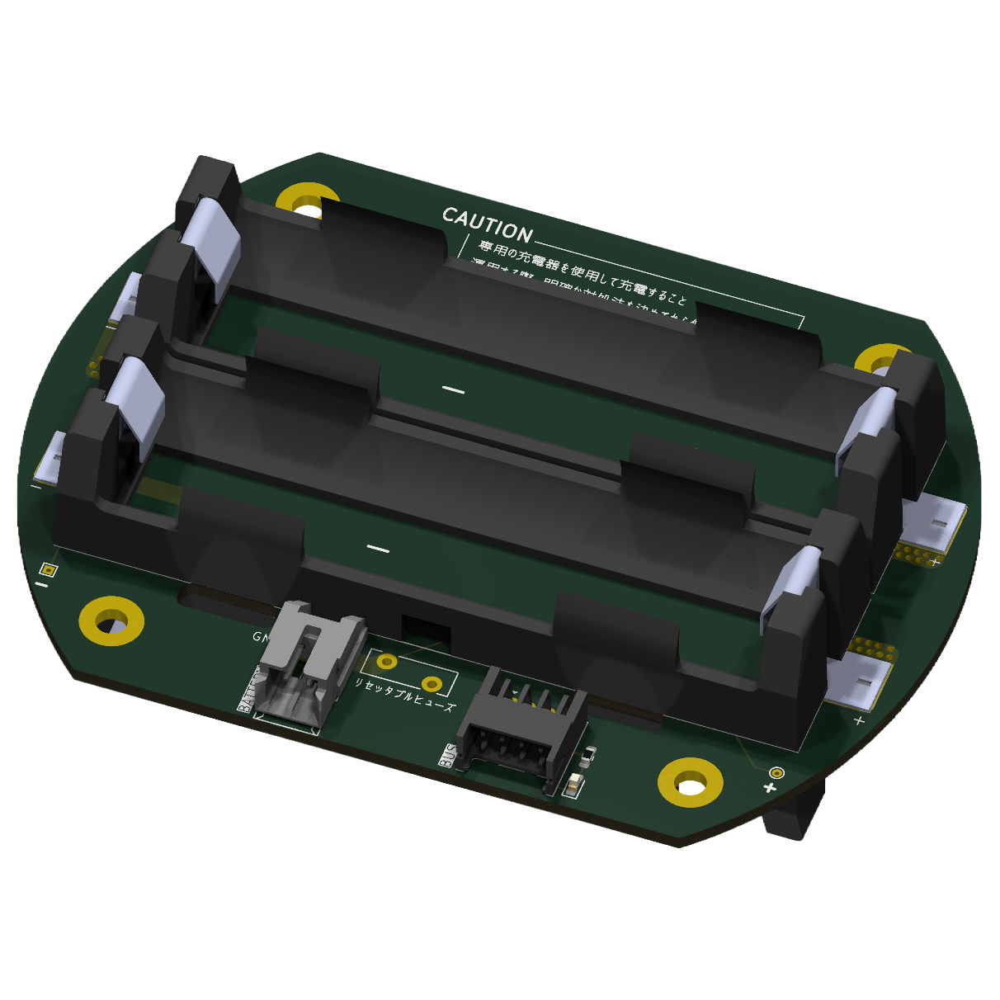
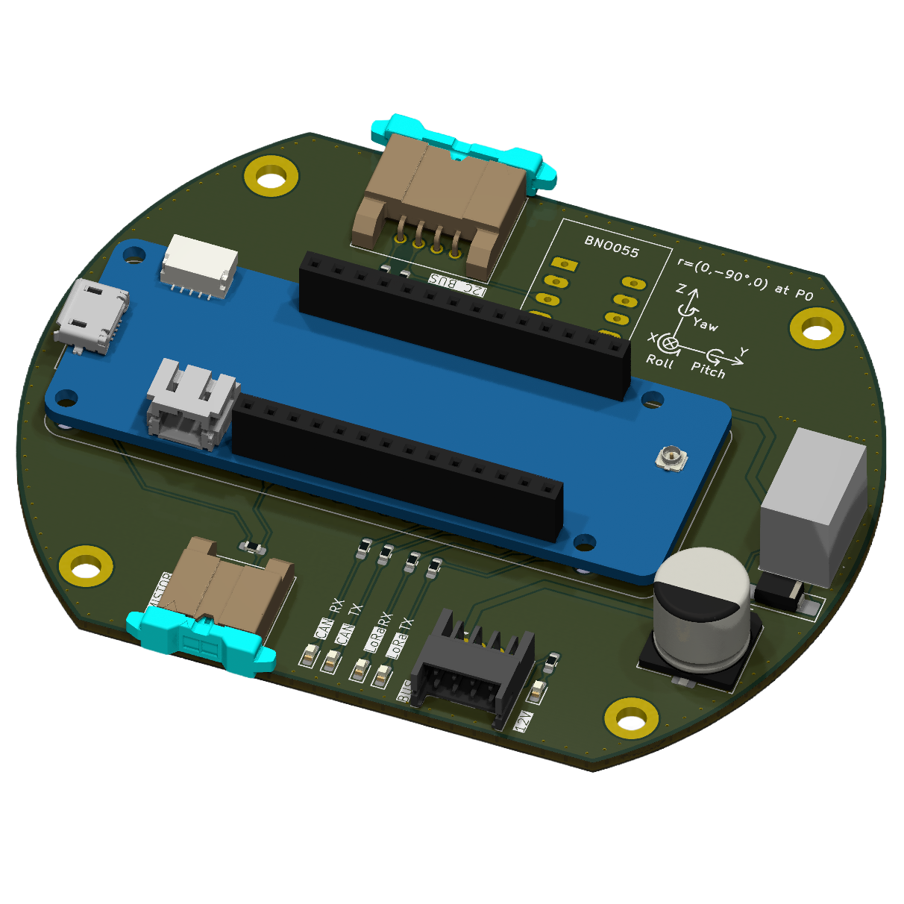
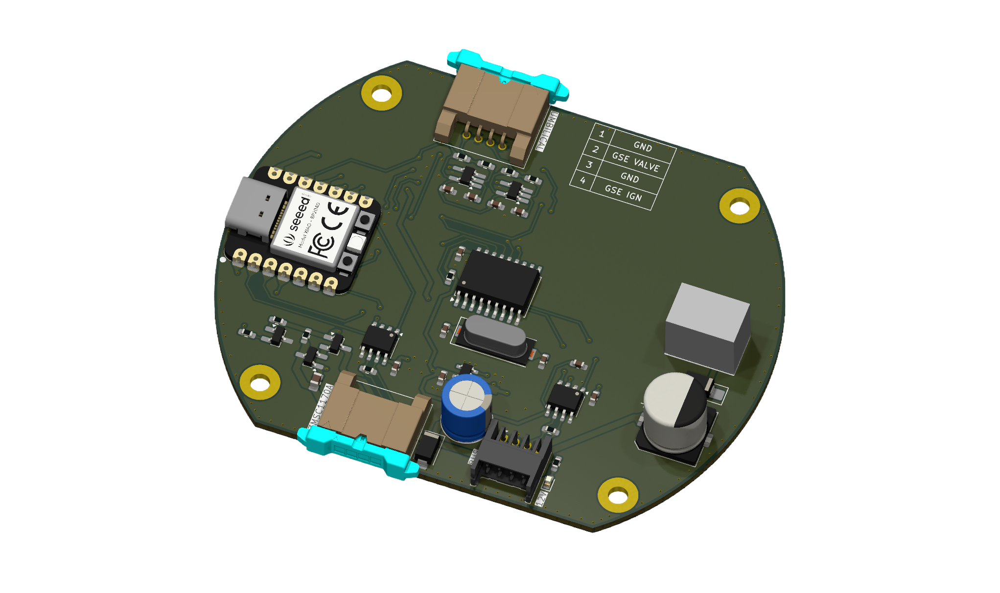

# H-62 Avionics プロジェクト報告書

## 目次

- [H-62 Avionics プロジェクト報告書](#h-62-avionics-プロジェクト報告書)
  - [目次](#目次)
  - [1. 概要](#1-概要)
  - [2. プロジェクト構成](#2-プロジェクト構成)
    - [2.1. ディレクトリ構造](#21-ディレクトリ構造)
    - [2.2. 開発環境](#22-開発環境)
  - [3. システム構成](#3-システム構成)
    - [3.1. 全体像](#31-全体像)
    - [3.2. ハードウェア](#32-ハードウェア)
      - [3.2.1. モジュール](#321-モジュール)
      - [3.2.2. 地上局](#322-地上局)
    - [3.3. ソフトウェア](#33-ソフトウェア)
    - [3.3.1 機体内部通信: `CAN`](#331-機体内部通信-can)
    - [3.3.2 対地通信: `LoRa`](#332-対地通信-lora)
  - [4. ビルドと書き込み](#4-ビルドと書き込み)
    - [4.1. 準備](#41-準備)
    - [4.2. 手順](#42-手順)
      - [4.2.1. PlatformIO UIを使用する方法](#421-platformio-uiを使用する方法)
      - [4.2.2. PlatformIO CLIを使用する方法](#422-platformio-cliを使用する方法)
    - [4.3. 主要なビルド環境](#43-主要なビルド環境)
  - [5. Webダッシュボード (地上局)](#5-webダッシュボード-地上局)
    - [5.1. 手順](#51-手順)
    - [5.2. 機能](#52-機能)
  - [6. ログの読み出し](#6-ログの読み出し)
    - [6.2. ビルド環境](#62-ビルド環境)
    - [6.3. 手順](#63-手順)
  - [00. 添付資料](#00-添付資料)

---

## 1. 概要

本ドキュメントは、H-62に搭載される「すばる1.3」の設計、機能、および運用方法について記述したものである。将来の拡張やメンテナンスのための引き継ぎ資料として利用することを目的とする。

このシステムは、ロケットに搭載される複数の**モジュール**と、地上でデータを受信する**地上局**の2つの主要コンポーネントから構成される。

## 2. プロジェクト構成

このプロジェクトは、ハードウェア設計、ソースコード、ドキュメント、試験コードなど、開発に必要なすべての要素を単一のリポジトリで管理している。

### 2.1. ディレクトリ構造

プロジェクトの全体像を把握するために、主要なディレクトリの役割を以下に示す。

- `src/`: すべての組込みソフトウェアのソースコードが格納されている。
  - `Flight/`: ロケットに搭載する各モジュール（Flight, Power, Sensing, ValveControl）のコード。
  - `Ground/`: 地上局用のコード。Webサーバー機能を持つものも含まれる。
  - `LogDumper/`: メモリ（FeRAM）からログを読み出すためのコード。
  - `Experiment/`: 各種実験用のコード。
- `lib/`: モジュール間で共通して使用されるライブラリ。
- `KiCAD/`: 各モジュールの回路図、PCBレイアウトなど、ハードウェアの設計データ。
- `Document/`: データシート、ブロック図、本報告書などのドキュメント類。
- `test/`: 本プロジェクトで行った試験の結果。
- `data/`: 地上局のWebダッシュボードで使用するHTMLやCSSファイル。
- `platformio.ini`: プロジェクトのビルド構成、ライブラリ依存関係などを定義したファイル。

### 2.2. 開発環境

- **IDE**: Visual Studio Code
- **拡張機能**: PlatformIO
- **言語**: Arduino

プロジェクトのビルド環境やライブラリ依存関係は、ルートディレクトリの `platformio.ini` ファイルで管理されている。

platformio.ini ファイルの構成を簡単に示す。
```
[env:FlightModule] 
platform = atmelsam
board = mkrwan1310
framework = arduino
monitor_speed = 115200
build_src_filter = +<Flight/FlightModule/FlightModule.cpp>
lib_deps = 
	SPI
	Wire
	seeed-studio/CAN_BUS_Shield@^2.3.3
	hideakitai/TaskManager@^0.5.2
	frankboesing/FastCRC@^1.41
	adafruit/Adafruit BusIO@^1.16.1
	jchristensen/movingAvg@^2.3.1
	hideakitai/Filters@^0.1.2
	sparkfun/SparkFun u-blox GNSS Arduino Library@^2.2.27
	hideakitai/CRCx@^0.4.0
	hideakitai/MsgPacketizer@^0.5.3
	bblanchon/ArduinoJson@^7.2.1
	sandeepmistry/LoRa@^0.8.0
```

`[env:FlightModule]` : ビルド環境名 ([参考ページ](https://docs.platformio.org/en/stable/projectconf/sections/env/index.html#working-env-name))

`platform` : 使用したいボードのマイコンファミリー ([参考ページ](https://docs.platformio.org/en/stable/projectconf/sections/env/options/platform/platform.html))

`board` : 使用したいボード ([参考ページ](https://docs.platformio.org/en/stable/projectconf/sections/env/options/platform/board.html))

`framework` : フレームワークの設定 ([参考ページ](https://docs.platformio.org/en/stable/frameworks/index.html#frameworks))

`monitor_speed` : シリアルモニタのボーレート([参考ページ](https://docs.platformio.org/en/stable/projectconf/sections/env/options/monitor/monitor_speed.html))(ただし，VSCodeの拡張機能である[Serial Monitor](https://marketplace.visualstudio.com/items?itemName=ms-vscode.vscode-serial-monitor)を使う場合は特に関係ない)

`build_src_filter` : どのプログラムを書きこむのか指定 ([参考ページ](https://docs.platformio.org/en/stable/projectconf/sections/env/options/build/build_src_filter.html))

`lib_deps` : 依存しているライブラリを指定 ([参考ページ](https://docs.platformio.org/en/stable/projectconf/sections/env/options/library/lib_deps.html))


## 3. システム構成

### 3.1. 全体像

システム全体の電源系統と接続の概要を以下に示す。

  

### 3.2. ハードウェア

#### 3.2.1. モジュール

- **FlightModule**: GPS、IMUなどを搭載し、分離制御とLoRaによるテレメトリー送信を行うモジュール。
  - **MCU**: `Arduino MKR WAN 1310`

  


- **PowerModule**: バッテリーから各モジュールへ電源を供給・管理するモジュール。
  - **MCU**: `Seeed XIAO RP2040`
  - **CAN**: `MCP2515 & MCP2562`
    - MCP2515とマイコンをSPI通信で接続しCAN通信を行う
    - MCP2562によりCAN通信の物理層を実装する
    - 必要に応じて終端抵抗(120Ω)が必要
  - **Power Management IC**: [`LTC4353`](https://www.digikey.jp/ja/products/detail/analog-devices-inc/LTC4353IMS-PBF/3305800)
    - 外付けのMOSFETを制御し理想ダイオードをの機能を実装する
    - MOSFETの選定には[`Si26DY`](https://www.digikey.jp/ja/products/detail/vishay-siliconix/SI4126DY-T1-GE3/1978841)がおすすめ
    - パッケージは複数あるがLTC4353IMS`#PBF`にすることで「足」が生えているためはんだ不良を検査しやすい
  - **DCDC Convertor**:[`LTC3119`](https://strawberry-linux.com/catalog/items?code=13119)
    - 最大負荷5Aに対応し18Vまで対応しているため便利で扱いやすい
    - ただし価格がお高め
  - [CAD | KiCAD はこちら](../../KiCAD/PowerControlModule/)

> [!NOTE]
> Power Module の詳細は [こちら](./PowerModuleInfo.md)

  

- **18650 Battery Module**: バッテリー固定用のモジュール。

  


- **SensingModule**: 圧力センサーなどを搭載し、詳細な環境データを取得する。
  - **MCU**: `Arduino MKR WAN 1310`
  - **CAN**: `MCP2515 & MCP2562`
    - MCP2515とマイコンをSPI通信で接続しCAN通信を行う
    - MCP2562によりCAN通信の物理層を実装する
    - 必要に応じて終端抵抗(120Ω)が必要
  - **Pressure Sensor**: `LPS28DFW`
    - 気圧と温度センサが一つのパッケージにまとまっている
    - 小型かつ防水（Oリングなどで工夫する必要有）なため使いやすい
  - **IMU**: `BNO055`
    - 入手性が良い


  


- **ValveControlModule**: バルブを制御するためのモジュール。
  - **MCU**: `Seeed XIAO RP2040`
  - **CAN**: `MCP2515 & MCP2562`
    - MCP2515とマイコンをSPI通信で接続しCAN通信を行う
    - MCP2562によりCAN通信の物理層を実装する
    - 必要に応じて終端抵抗(120Ω)が必要
  - **RS485**: `MAX3485`
    - 3.3V駆動のRS485/RS422トランシーバー

  


#### 3.2.2. 地上局

地上でフライトモジュール、センシングモジュールからのデータを受信し、可視化する。

- **LILYGO T-Beam**: LoRaで受信したデータをOLEDに表示すると同時に、Wi-Fi経由でWebダッシュボードにリアルタイム表示する。([商品ページ](https://lilygo.cc/products/t-beam?srsltid=AfmBOop5EgjoO9m0INnMgOT41JxyNSMiZya5QNhKdbZDgODq3Bx6JJTY))
  - **MCU**: `ESP32`
  - **ディスプレイ**: `SSD1306` OLEDディスプレイ
  - **GPS**: `NEO-6M`
  - **PMU**: `AXP2101`
  - **Wireless protocol**: `Wi-Fi + Bluetooth 4.2`

  


### 3.3. ソフトウェア

### 3.3.1 機体内部通信: `CAN`

  機体内部の通信にはCAN通信を採用している．これは差動信号であるためノイズ耐性が高いこととパケット構造（データフレームと呼ぶ）が決まっているため扱いやすい良い点が挙げられる．

  CAN周りのソースコードは[`Lib_CAN.hpp`](/lib/Lib_CAN/Lib_CAN.hpp), [`Lib_CAN.cpp`](/lib/Lib_CAN/Lib_CAN.cpp)に記述されている．そして，CANのIDは[`Lib_Var.hpp`](/lib/Lib_Var/Lib_Var.hpp)に定義されている．

  CAN IDのとれる値の範囲は**標準フォーマット**を使用している．なお，拡張フォーマットを使用することも可能だがそこまでの大規模システムを構築する必要はないと考える．

  | フォーマット     | ビット長 | 10進数の範囲  | 16進数の範囲          |
  | ---------------- | -------- | ------------- | --------------------- |
  | 標準フォーマット | 11ビット | 0~2,047       | 0x000~0x7FF           |
  | 拡張フォーマット | 29ビット | 0~536,870,911 | 0x00000000~0x1FFFFFFF |

 
  以下に，CANのデータ構造をまとめる．


  **FLIGHT_DATA (ID: 0x00)**

  `役割`：フライトデータ送信, `データ長`: 7 Byte
  | フィールド名 | オフセット (Byte) | サイズ (Byte) | データ型 | 説明                                    |
  | ------------ | ----------------- | ------------- | -------- | --------------------------------------- |
  | flightMode   | 0                 | 1             | uint8_t  | 現在のフライトモード                    |
  | flightTime   | 1                 | 4             | uint32_t | 飛行時間 [ ms ]                         |
  | doLogging    | 5                 | 1             | bool     | ロギング実行フラグ( 1: True, 0: False ) |
  | ident        | 6                 | 1             | char     | 識別子(A, B など)                       |


  **TRAJECTORY_DATA (ID: 0x01)**

  `役割`: 軌道データ送信, `データ長`: 5 Byte
  | フィールド名 | オフセット (Byte) | サイズ (Byte) | データ型 | 説明       |
  | ------------ | ----------------- | ------------- | -------- | ---------- |
  | isFalling    | 0                 | 1             | bool     | 降下判定   |
  | altitude     | 1                 | 4             | float    | 高度 [ m ] |


  **GSE_SIGNAL (ID: 0x02)**

  `役割`: イグニッションの実行判定, `データ長`: 1 Byte
  | フィールド名 | オフセット (Byte) | サイズ (Byte) | データ型 | 説明                                       |
  | ------------ | ----------------- | ------------- | -------- | ------------------------------------------ |
  | isIgnition   | 0                 | 1             | bool     | イグニッション実行フラグ ( 1: On, 0: Off ) |


  **VALVE_MODE (ID: 0x03)**

  `役割`: バルブモードの実行判定, `データ長`: 1 Byte
  | フィールド名 | オフセット (Byte) | サイズ (Byte) | データ型 | 説明                                     |
  | ------------ | ----------------- | ------------- | -------- | ---------------------------------------- |
  | isLaunchMode | 0                 | 1             | bool     | ローンチモード ( 1: Launch, 0: Waiting ) |


  **VALVE_DATA_PART1 (ID: 0x10B)**

  `役割`: サーボモーターからの情報, `データ長`: 8 Byte
  | フィールド名     | オフセット (Byte) | サイズ (Byte) | データ型 | 説明                                    |
  | ---------------- | ----------------- | ------------- | -------- | --------------------------------------- |
  | motorTemperature | 0                 | 2             | int16_t  | サーボモーターの温度 [ *C ]             |
  | mcuTemperature   | 2                 | 2             | int16_t  | サーボモーター制御マイコンの温度 [ *C ] |
  | current          | 4                 | 2             | int16_t  | サーボモーターに流れた電流 [ A ]        |
  | inputVoltage     | 6                 | 2             | uint16_t | サーボモーターへの入力電圧 [ V ]        |


  **VALVE_DATA_PART2 (ID: 0x10C)**

  `役割`: サーボモーターからの情報, `データ長`: 6 Byte
  | フィールド名           | オフセット (Byte) | サイズ (Byte) | データ型 | 説明                                     |
  | ---------------------- | ----------------- | ------------- | -------- | ---------------------------------------- |
  | currentPosition        | 0                 | 2             | int16_t  | サーボモーターの現在角度 [ deg ]         |
  | currentDesiredPosition | 2                 | 2             | int16_t  | サーボモーター制御マイコンの温度 [ deg ] |
  | currentVelocity        | 4                 | 2             | int16_t  | サーボモーターに流れた電流 [ deg/s ]     |


  **VALVE_DATA_PART3 (ID: 0x10D)**

  `役割`: サーボモーターからの情報, `データ長`: 8 Byte
  | フィールド名     | オフセット (Byte) | サイズ (Byte) | データ型 | 説明                                    |
  | ---------------- | ----------------- | ------------- | -------- | --------------------------------------- |
  | motorTemperature | 0                 | 2             | int16_t  | サーボモーターの温度 [ *C ]             |
  | mcuTemperature   | 2                 | 2             | int16_t  | サーボモーター制御マイコンの温度 [ *C ] |
  | current          | 4                 | 2             | int16_t  | サーボモーターに流れた電流 [ A ]        |
  | inputVoltage     | 6                 | 2             | uint16_t | サーボモーターへの入力電圧 [ V ]        |


  **VALVE_DATA_PART4 (ID: 0x10E)**

  `役割`: サーボモーターからの情報, `データ長`: 6 Byte
  | フィールド名           | オフセット (Byte) | サイズ (Byte) | データ型 | 説明                                     |
  | ---------------------- | ----------------- | ------------- | -------- | ---------------------------------------- |
  | currentPosition        | 0                 | 2             | int16_t  | サーボモーターの現在角度 [ deg ]         |
  | currentDesiredPosition | 2                 | 2             | int16_t  | サーボモーター制御マイコンの温度 [ deg ] |
  | currentVelocity        | 4                 | 2             | int16_t  | サーボモーターに流れた電流 [ deg/s ]     |


  **MONITOR_BUS (ID: 0x10F)**

  `役割`: バスの電力監視, `データ長`: 8 Byte
  | フィールド名       | オフセット (Byte) | サイズ (Byte) | データ型 | 説明                  |
  | ------------------ | ----------------- | ------------- | -------- | --------------------- |
  | busVoltage_int     | 0                 | 2             | int16_t  | CANバス電圧監視 [ V ] |
  | busCurrent_int     | 2                 | 2             | int16_t  | CANバス電流 [ A ]     |
  | busPower_int       | 4                 | 2             | int16_t  | CANバス電力 [ W ]     |
  | busTemperature_int | 6                 | 2             | int16_t  | ICの温度 [ *C ]       |


  **MONITOR_BATTERY (ID: 0x110)**

  `役割`: バッテリーの電力監視, `データ長`: 8 Byte
  | フィールド名           | オフセット (Byte) | サイズ (Byte) | データ型 | 説明                     |
  | ---------------------- | ----------------- | ------------- | -------- | ------------------------ |
  | batteryVoltage_int     | 0                 | 2             | int16_t  | バッテリー電圧監視 [ V ] |
  | batteryCurrent_int     | 2                 | 2             | int16_t  | バッテリー電流 [ A ]     |
  | batteryPower_int       | 4                 | 2             | int16_t  | バッテリー電力 [ W ]     |
  | batteryTemperature_int | 6                 | 2             | int16_t  | ICの温度 [ *C ]          |


  **MONITOR_EXTERNAL (ID: 0x111)**

  `役割`: 外部給電の電力監視, `データ長`: 8 Byte
  | フィールド名            | オフセット (Byte) | サイズ (Byte) | データ型 | 説明                     |
  | ----------------------- | ----------------- | ------------- | -------- | ------------------------ |
  | externalVoltage_int     | 0                 | 2             | int16_t  | 外部給電の電圧監視 [ V ] |
  | externalCurrent_int     | 2                 | 2             | int16_t  | 外部給電の電流 [ A ]     |
  | externalPower_int       | 4                 | 2             | int16_t  | 外部給電の電力 [ W ]     |
  | externalTemperature_int | 6                 | 2             | int16_t  | ICの温度 [ *C ]          |


### 3.3.2 対地通信: `LoRa`
  - [`hideakitai/MsgPacketizer`](https://github.com/hideakitai/MsgPacketizer) ライブラリを利用したカスタムバイナリ形式
  - **テレメトリーパケット (すばる -> 地上局)**: 識別子 `0x0A`
  - **コマンドパケット (地上局 -> すばる)**: 識別子 `0xF1` ~ `0xF3`


## 4. ビルドと書き込み

### 4.1. 準備

1. [Visual Studio Code](https://code.visualstudio.com/) をインストールする。
2. VSCodeの拡張機能パネルから `PlatformIO IDE` をインストールする。
3. 本プロジェクトをVSCodeで開くと、PlatformIOが必要なライブラリ (`platformio.ini` の `lib_deps`) を自動的にインストールする。

### 4.2. 手順

ビルドと書き込みは、VSCodeのPlatformIO UI、またはコマンドライン(CLI)から実行できる。

#### 4.2.1. PlatformIO UIを使用する方法

1. VSCodeの左側にあるPlatformIOアイコン (エイリアンの頭のようなアイコン) をクリックする。
2. `Project Tasks` の中から、対象の環境 (`env:***`) を見つける。
3. `Build` をクリックするとコンパイルが実行される。
4. `Upload` をクリックすると、接続されているデバイスにプログラムが書き込まれる。
5. `Monitor` をクリックすると、シリアルモニターが起動する。

#### 4.2.2. PlatformIO CLIを使用する方法

ターミナルから以下のコマンドを実行する。`-e` の後に対象の環境名を指定する。

```bash
# ビルドのみ
pio run -e <環境名>

# ビルドして書き込む
pio run -t upload -e <環境名>

# シリアルモニターを起動
pio device monitor -e <環境名>
```

### 4.3. 主要なビルド環境

`platformio.ini` には多数の環境が定義されているが、主に以下の環境を使用する。

| 用途                             | 環境名 (`env:***`)       | ボード              | ソースコード                                        |
| :------------------------------- | :----------------------- | :------------------ | :-------------------------------------------------- |
| **フライトモジュール**           | `FlightModule`           | `mkrwan1310`        | `src/Flight/FlightModule/`                          |
| **センシングモジュール**         | `SensingModule`          | `mkrwan1310`        | `src/Flight/SensingModule/`                         |
| **パワーモジュール**             | `PowerModule`            | `seeed-xiao-rp2040` | `src/Flight/PowerModule/`                           |
| **バルブコントロールモジュール** | `ValveControlModule`     | `seeed-xiao-rp2040` | `src/Flight/ValveControlModule/`                    |
| **地上局 (Webサーバー付き)**     | `CSVGroundFlightModule`  | `esp32dev`          | `src/Ground/CSV/FlightModule/`                      |
| **地上局**                       | `CSVGroundSensingModule` | `esp32dev`          | `src/Ground/CSV/SensingModule/`                     |
| **地上局 (船回収隊)**            | `SeaFlightModule`        | `esp32dev`          | `src/Ground/T-BEAM/FlightModule/`                   |
| **地上局（点火点）**             | `TeleplotFlightModule`   | `mkrwan1310`        | `src/Ground/Teleplot/FlightModule/FlightModule.cpp` |


## 5. Webダッシュボード (地上局)

地上局 (Webサーバー付き) (`CSVGroundFlightModule`) は、受信したデータをリアルタイムで表示するWebダッシュボード機能を持つ。

### 5.1. 手順

1. `src/Ground/CSV/FlightModule/FlightModule.cpp` のWi-Fi設定を自身の環境に合わせて変更する。
   ```cpp
   const char* ssid = "YOUR_WIFI_SSID";
   const char* password = "YOUR_WIFI_PASSWORD";
   ```
2. 地上局をビルドし、ESP32に書き込む。
3. シリアルモニターを起動し、Wi-Fi接続後に表示されるIPアドレスを確認する。
4. PCやスマートフォンのブラウザでそのIPアドレスにアクセスする。

### 5.2. 機能

- **リアルタイム更新**: JavaScript (AJAX) を利用し、ページ全体をリロードすることなく、データ部分のみを非同期で更新する。下記は、デモプログラムを動作させた様子である。


## 6. ログの読み出し

ログを読み出す際は，ログダンパー(LogDumoer)というビルド環境をマイコンに書き込む。

### 6.2. ビルド環境

| 用途                     | 環境名 (`env:***`)       | ボード       | ソースコード                                    |
| :----------------------- | :----------------------- | :----------- | :---------------------------------------------- |
| **フライトモジュール**   | `LogDumper_FlightModule` | `mkrwan1310` | `src/LogDumper/FlightModule/FlightModule.cpp`   |
| **センシングモジュール** | `LogDumperSensingModule` | `mkrwan1310` | `src/LogDumper/SensingModule/SensingModule.cpp` |

### 6.3. 手順

1. VSCodeの左側にあるPlatformIOアイコン (エイリアンの頭のようなアイコン) をクリックする。
2. `Project Tasks` の中から、対象の環境 (`env:***`) を見つける。
3. `Build` をクリックするとコンパイルが実行される。
4. `Upload` をクリックすると、接続されているデバイスにプログラムが書き込まれる。
5. TeraTermを開き`シリアル`を選択し，任意のCOMポートを選択する。
6. `OK`をクリックするとログ読み出しが開始される。(TeraTermで自動ログ保存機能を有効にしておくと便利 [参考ページ](https://www.reseau.co.jp/blog/archives/44))

## 00. 添付資料

- 各種電子部品のデータシートは `Document/Datasheet/` に格納されている。
- システムのブロック図などは `Document/BlockDiagram/` に格納されている。
- ハードウェアの3Dモデルや基板写真は `Document/Image/` に格納されている。